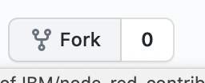
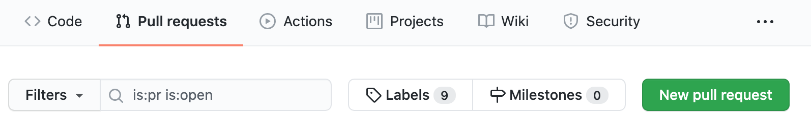
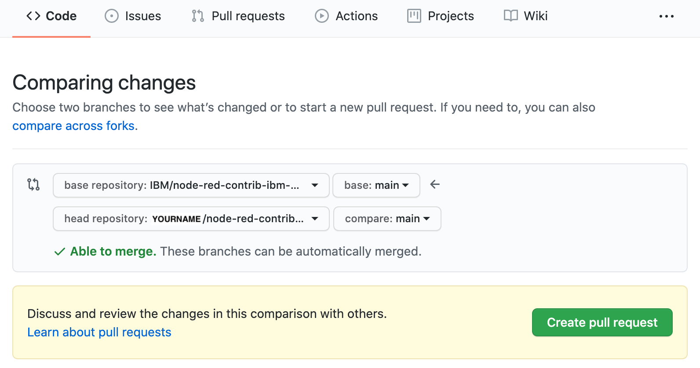

# Contributing to node-red-contrib-ibm-mvi Project


## Option1. Search your symptom or new feature in existing issues

Before submitting a new issue, you may find your symptom in past discussions in [Issues](https://github.com/IBM/node-red-contrib-ibm-mvi/issues?q=is%3Aissue). 


## Option2. Submit a new issue

If you cannot find your symptom or , then please share the problem with us by submitting a [new issue](https://github.com/IBM/node-red-contrib-ibm-mvi/issues/new/choose).


## Option3. Fork/Branch the repository, commit your code with signoff, and send pull request


### Developer Certificate of Origin (DCO)

node-red-contrib-ibm-mvi  have tried to make it as easy as possible to make contributions. This applies to how we handle the legal aspects of contribution. We use the same approach - the [DCO1.1.txt](DCO1.1.txt)  that the Linux® Kernel [community](https://elinux.org/Developer_Certificate_Of_Origin) uses to manage code contributions. We simply ask that when submitting a patch for review, the developer must include a sign-off statement in the commit message. Here is an example Signed-off-by line, which indicates that the submitter accepts the DCO:

```
Signed-off-by: John Doe <john.doe@example.com>
```

You can include this automatically when you commit a change to your local git repository using the following command:

```
git commit -s
```


### Procedure


#### Developer not in IBM

1. Push `fork` button
    
2. Clone your forked repo (`git clone git@github.com:YOURNAME/node-red-contrib-ibm-mvi.git`)
3. Add your changes (`git add MODIFIED_FILES`)
4. Commit your changes (`git commit -s -m 'Add some feature'`)
5. Push to the branch (`git push origin main`)
6. In `Pull requests` tab, push `New pull request` button.
    
7. Push `Create pull request` button.
    


#### Developer in IBM Group

1. Clone this repo (`git clone git@github.com:IBM/node-red-contrib-ibm-mvi.git`)
2. Create your feature branch (`git checkout -b my-new-feature`)
3. Add your changes (`git add MODIFIED_FILES`)
4. Commit your changes (`git commit -s -m 'Add some feature'`)
5. Push to the branch (`git push origin my-new-feature`)
6. Create a new Pull Request

