# Node-RED nodes for IBM Maximo Visual Inspection (MVI)

  [Maximo Visual Inspection (MVI)](https://www.ibm.com/products/maximo/remote-monitoring#section-heading-4) makes computer vision with deep learning more accessible to business users. MVI includes an intuitive toolset that empowers subject matter experts to label, train, and deploy deep learning vision models, without coding or deep learning expertise. 

  node-red-contrib-ibm-mvi  is a [Node-RED](https://nodered.org/) module for IBM Maximo Visual Inspection (MVI). This repo provides nodes that make MVI easy to use. Also a flow of Node-RED is easy to understand what the flow does because of its graphical flow  representation.


----

- [Node-RED nodes for IBM Maximo Visual Inspection (MVI)](#node-red-nodes-for-ibm-maximo-visual-inspection--mvi-)
    * [Setup](#setup)
    * [Usage](#usage)
    * [Examples](#examples)
        + [Inspection with MVI server](#inspection-with-mvi-server)
        + [Inspection with MVI Edge server](#inspection-with-mvi-edge-server)
        + [Custom inspection with MVI edge server (Cloud Festa 2021)](#custom-inspection-with-mvi-edge-server--cloud-festa-2021-)
    * [Author](#author)
    * [License](#license)


## Setup

1. Initialize local npm environment.
    ```sh
    $ mkdir workdir && cd workdir
    $ npm init -y
    ```
    
2. Install Node-RED, Email node
    ```sh
    $ npm install node-red

3. Download tar.gz file from [Releases](https://github.com/IBM/node-red-contrib-ibm-mvi/releases)
4. Install tar.gz file

    ```sh
    $ npm install node-red-contrib-ibm-mvi-1.0.0.tgz
    ```


## Usage

1. Start Node-RED
    ```sh
    $ ./node_modules/.bin/node-red
    ```
    
2. Open Node-RED GUI [http://localhost:1880/](http://localhost:1880/)
   
3. Drag & Drop MVI nodes from pallet to flow
    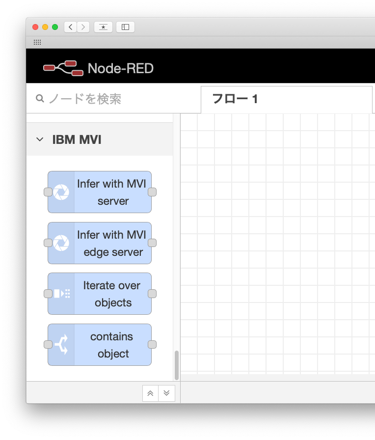


## Examples


### Inspection with MVI server


1. Drag & drop `http in`, `http response`, and `infer with MVI server`nodes.
    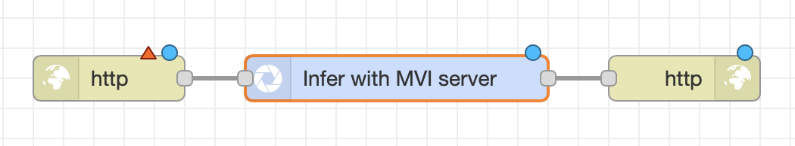
    
2. Select `POST` method and `Accept file uploads`, and set URL `/inspect`
    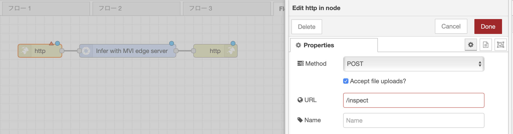
    
3. Copy inference URL by clicking `Copy` button in deployed model dashboard.
    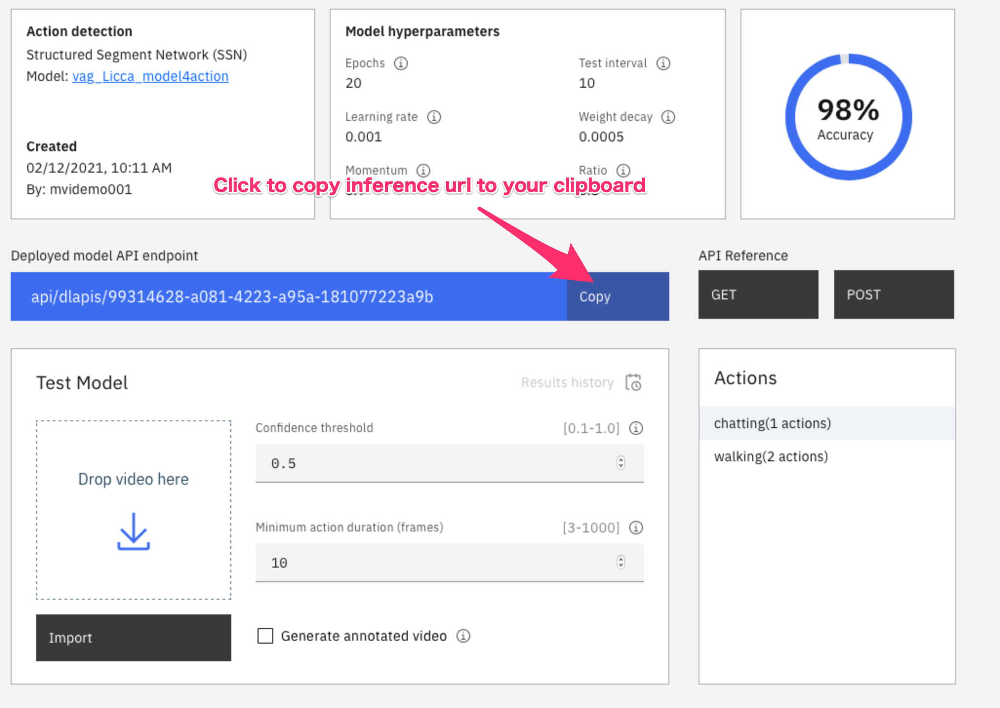

4. Paste the url to property page of `infer with MVI server` node in Node-RED.
    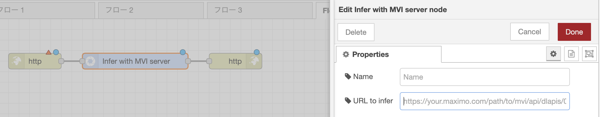

5. Test the flow by using curl
    ```sh
    $ curl -i -F files=@path/to/wear_image.jpeg http://localhost:1880/inspect
    ```


### Inspection with MVI Edge server

1. Drag & drop `http in`, `http response`, and `infer with MVI Edge server`nodes.
    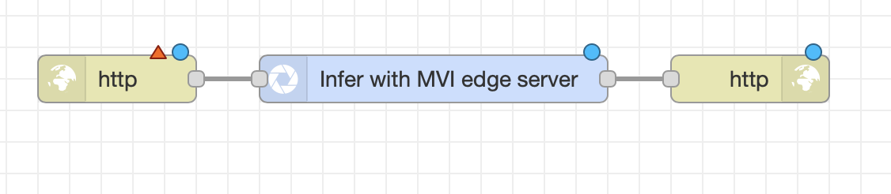
    
2. Select `POST` method and `Accept file uploads`, and set URL `/inspect`
    
    
3. Identify http port number that provides MVI Edge service on Edge Server by executing `docker ps`. For example, `8080` port provides the MVI service below.
   
    ```sh
    [Edge Server] $ docker ps 
    CONTAINER ID   IMAGE                           COMMAND                  CREATED      STATUS      PORTS                    NAMES
    21851c707ce1   vision-dnn-deploy-x86:1.3.0.0   "/opt/DNN/bin/setup_…"   2 days ago   Up 2 days   0.0.0.0:8080->5001/tcp   wear_inspection
    ```
    
4. Double click `Infer with MVI edge server` node and set URL `http://localhost:8080/inference`
    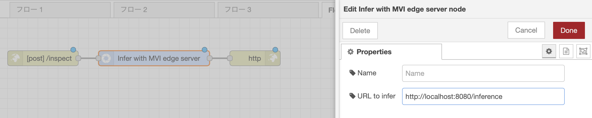
5. Test the flow by using curl
    ```sh
    $ curl -i -F files=@path/to/wear_image.jpeg http://localhost:1880/inspect
    ```


### Custom inspection with MVI edge server (Cloud Festa 2021)

1. install email node & restart Node-RED
    ```sh
    $ npm install node-red-node-email
    ```
    
2. Copy the following json to your clipboard
    ```json
    [{"id":"f273d263.653618","type":"http in","z":"f876ec98.2830b8","name":"","url":"/inspect","method":"post","upload":true,"swaggerDoc":"","x":160,"y":60,"wires":[["94412a3.5300658"]]},{"id":"3dc74f4d.75869","type":"join","z":"f876ec98.2830b8","name":"","mode":"custom","build":"array","property":"payload","propertyType":"msg","key":"topic","joiner":"\\n","joinerType":"str","accumulate":false,"timeout":"","count":"","reduceRight":false,"reduceExp":"","reduceInit":"","reduceInitType":"","reduceFixup":"","x":1590,"y":560,"wires":[["8fc326b.9d49ad8"]]},{"id":"8fc326b.9d49ad8","type":"http response","z":"f876ec98.2830b8","name":"return resutls as JSON","statusCode":"","headers":{},"x":1750,"y":640,"wires":[]},{"id":"66857a22.73a244","type":"ibm-mvi-iterate-over-objects","z":"f876ec98.2830b8","name":"","objectLabel":"Human","x":360,"y":240,"wires":[["de5ab147.3ba388"],["3f1cd422.3dc8fc"]]},{"id":"3f1cd422.3dc8fc","type":"http response","z":"f876ec98.2830b8","name":"return OK because of no Human","statusCode":"","headers":{},"x":650,"y":240,"wires":[]},{"id":"94412a3.5300658","type":"ibm-mvi-edge-server-infer","z":"f876ec98.2830b8","name":"","mviUriToInfer":"http://localhost:5000/inference","x":310,"y":140,"wires":[["66857a22.73a244"]]},{"id":"2426eac5.3385a6","type":"group","z":"f876ec98.2830b8","name":"Flow for each human","style":{"label":true},"nodes":["bb3efe5.05cfa8","8c656000.9efc88","638e051.737f97c","de5ab147.3ba388","eff1b3f6.6749","6d47b983.b42dc","df149778.156ee"],"x":414,"y":299,"w":1192,"h":242},{"id":"bb3efe5.05cfa8","type":"function","z":"f876ec98.2830b8","g":"2426eac5.3385a6","name":"set NG","func":"msg.payload[\"result\"] = \"NG\";\n\nreturn msg;\n","outputs":1,"noerr":0,"initialize":"","finalize":"","libs":[],"x":1320,"y":500,"wires":[["3dc74f4d.75869","6d47b983.b42dc","df149778.156ee"]]},{"id":"8c656000.9efc88","type":"function","z":"f876ec98.2830b8","g":"2426eac5.3385a6","name":"set OK","func":"msg.payload[\"result\"] = \"OK\";\nreturn msg;\n","outputs":1,"noerr":0,"initialize":"","finalize":"","libs":[],"x":1330,"y":340,"wires":[["3dc74f4d.75869"]]},{"id":"638e051.737f97c","type":"ibm-mvi-object-contains","z":"f876ec98.2830b8","g":"2426eac5.3385a6","name":"","objectLabel":"Bag","negation":true,"x":840,"y":360,"wires":[["eff1b3f6.6749"],["bb3efe5.05cfa8"]]},{"id":"de5ab147.3ba388","type":"ibm-mvi-object-contains","z":"f876ec98.2830b8","g":"2426eac5.3385a6","name":"","objectLabel":"RedNeckStrap","negation":false,"x":550,"y":380,"wires":[["638e051.737f97c"],["bb3efe5.05cfa8"]]},{"id":"eff1b3f6.6749","type":"ibm-mvi-object-contains","z":"f876ec98.2830b8","g":"2426eac5.3385a6","name":"","objectLabel":"PC","negation":true,"x":1080,"y":340,"wires":[["8c656000.9efc88"],["bb3efe5.05cfa8"]]},{"id":"6d47b983.b42dc","type":"e-mail","z":"f876ec98.2830b8","g":"2426eac5.3385a6","server":"your.smtp.server","port":"465","secure":true,"tls":true,"name":"","dname":"","x":1530,"y":380,"wires":[]},{"id":"df149778.156ee","type":"exec","z":"f876ec98.2830b8","g":"2426eac5.3385a6","command":"osascript -e 'display notification \"IBM Maximo Visual Inspection\" with title \"Wear rule violation is detected\"'","addpay":"","append":"","useSpawn":"false","timer":"","oldrc":false,"name":"Notify","x":1530,"y":460,"wires":[[],[],[]]}]
    ```
    
3. Import the flow
    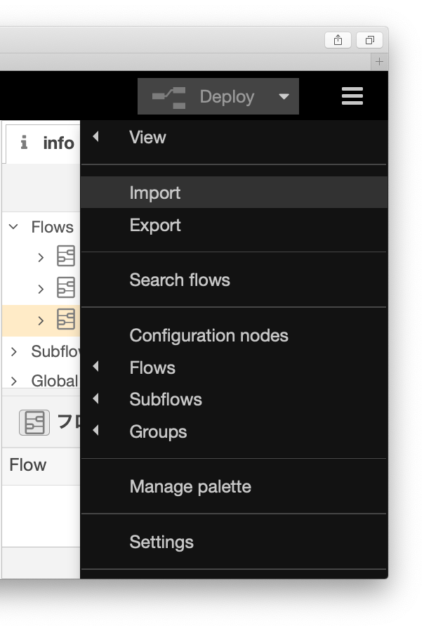

4. Paste the JSON and click import button
    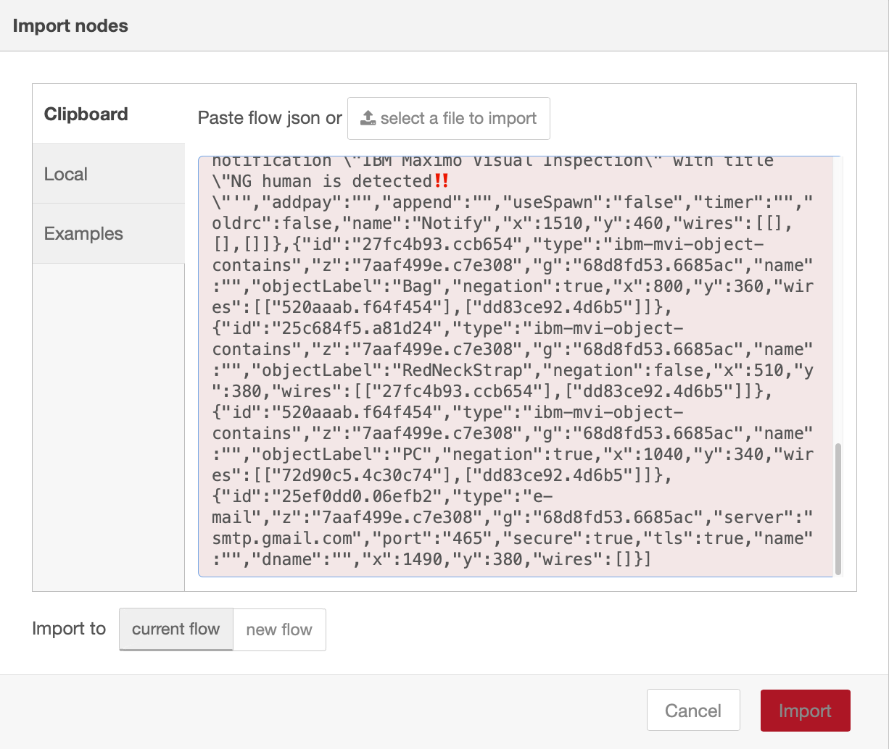
    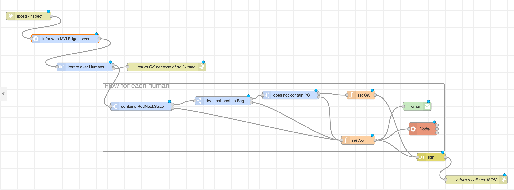


4. Identify http port number that provides MVI Edge service on Edge Server by executing `docker ps`. For example, `8080` port provides the MVI service below.

    ```sh
    [Edge Server] $ docker ps 
    CONTAINER ID   IMAGE                           COMMAND                  CREATED      STATUS      PORTS                    NAMES
    21851c707ce1   vision-dnn-deploy-x86:1.3.0.0   "/opt/DNN/bin/setup_…"   2 days ago   Up 2 days   0.0.0.0:8080->5001/tcp   wear_inspection
    
    ```

5. Double click `Infer with MVI edge server` node and set URL `http://localhost:8080/inference`
    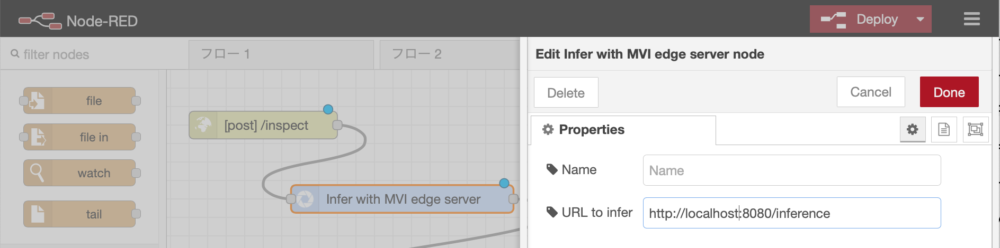
    
6. Double click `email` node and set
   
    1. Destination email address
    2. SMTP server address
    3. userID and password of the SMTP server
    
        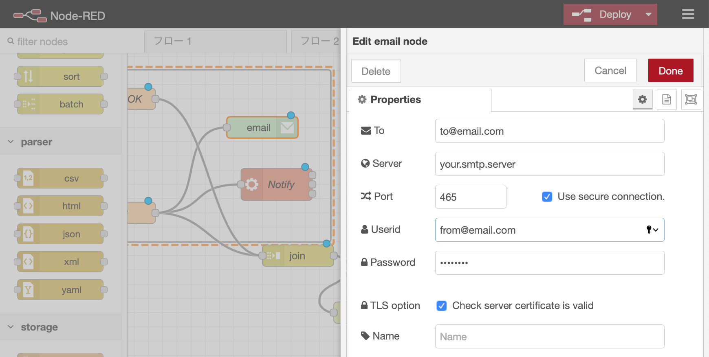
    
7. Double click `Notify` node. and set notify command.
   
    1. **If Node-RED on MAC OS**:  `osascript -e 'display notification "IBM Maximo Visual Inspection" with title "Wear rule violation is detected"'`
    2. **If Node-RED on Linux**: `notify-send "Wear rule violation is detected"`
        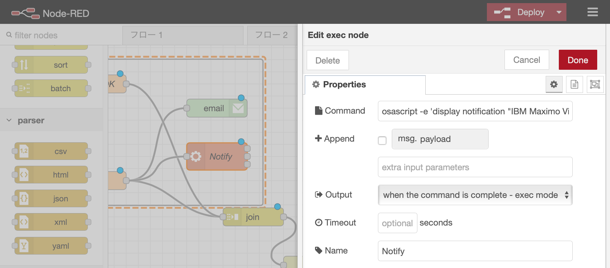
    
8. Click deploy button.

9. Test the flow by using curl
   
    ```sh
    $ curl -i -F files=@path/to/wear_image.jpeg http://localhost:1880/inspect
    ```
    
    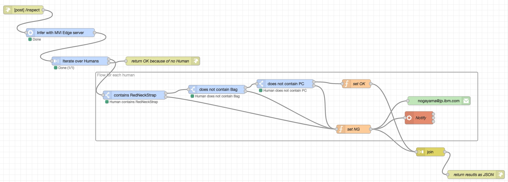


Author
------

- **Takahide Nogayama** - [Nogayama](https://github.com/nogayama)


License
-------

This project is licensed under the MIT License - see the [LICENSE](./LICENSE) file for details

Contributing
------------

Please read [CONTRIBUTING.md](./CONTRIBUTING.md) for details on our code of conduct, and the process for submitting pull requests to us.
